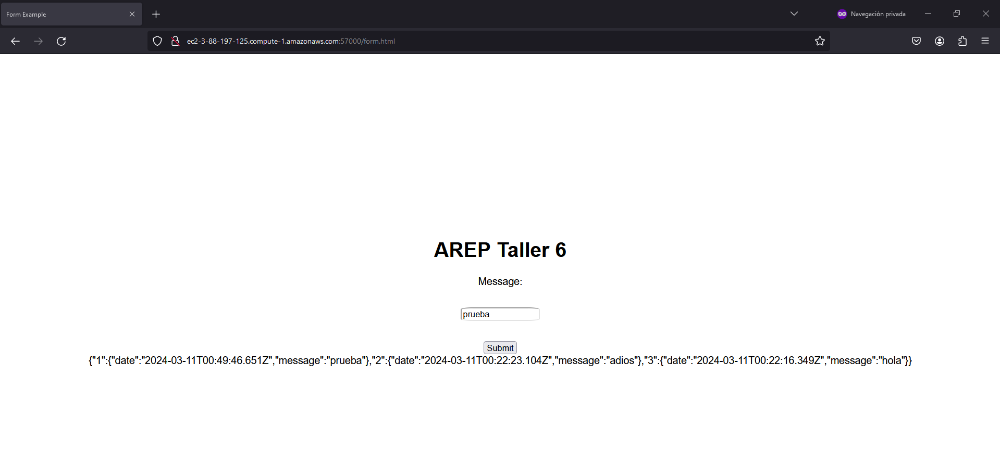

# TALLER 6, PATRONES ARQUITECTYURALES EN LA NUBE 

Este proyecto implementa servicios REST basicos, usando contenedores en Docker para correr la aplicación y como añadido, se suben las imagenes configuradas de docker a una maquina virtual de AWS EC2 y prestar el servicio montado a los clientes con acceso a internet.

## REQUISITOS
* [Docker desktop](https://www.docker.com/products/docker-desktop/) - Motor de contenedores
* [Java version 17](https://www.oracle.com/co/java/technologies/downloads/) - Lenguaje de programación usado.
* [Maven](https://maven.apache.org/download.cgi) - Gestor de dependencias del proyecto
* [Git](https://git-scm.com/downloads) - Gestion de versiones del proyecto 

## EJECUCION
A continuación, se enuncian las diferentes formas de correr el proyecto localmente, posteriormente, el acceso al servicio en AWS del proyecto.
### Descargando el proyecto (Usando GitHub)
1. Clonar el repositorio en su maquina (debe cumplir con los requisitos previos)

```bash
git clone https://github.com/santiforero1018/AREP-TALLER6.git
```
2. Entrar a las carpetas del proyecto por medio de la consola, dichas carpetas son *Facade-RoundRobin* y *MongoDb/mongotaller6* y luego compilar el codigo que se encuentra dentro de las carpetas.

```bash
cd Facade-RoundRobin
mvn clean install
cd ..\MongoDb\mongotaller6
mvn clean install
```

3. construir las imagenes con Docker para almacenar el proyecto y levantar la aplicación.

```bash
docker build --tag foreman1018/arep-taller6:roundrobin .
docker build --tag foreman1018/arep-taller6:db .
```

ejecutar los comandos previos en las carpetas *Facade-RoundRobin* y *MongoDb/mongotaller6* respectivamente

### Descargando el proyecto (Usando Docker Hub)

El proyecto ya fue construido y almacenado en Docker Hub, simplemente tiene que decargar las imagenes con el siguiente comando:

```bash
docker pull foreman1018/arep-taller6:roundrobin
docker pull foreman1018/arep-taller6:db
```
### Ejecucion final del proyecto

- Si accedió y descargo el proyecto desde github, dirijase a la carpeta *Facade-RoundRobin* (puede por medio del explorador de archivos dirigirse ahi y luego abril una terminal o usando comandos del SO puede dirigirse a dicha carpeta) y ejecute el siguiente comando:

```bash
docker-compose up -d
```

- Si accedió y descargo el proyecto desde Docker hub, copie el contenido del siguiente archivo .yml en uno respectivo:

```yaml
version: "1"

services:
  db:
    image: mongo:3.6.1
    container_name: db
    volumes:
      - mongodb:/data/db
      - mongodb_config:/data/configdb
    ports:
      - 27017:27017
    command: mongod
  logservice1:
    image: foreman1018/arep-taller6:db
    ports:
      - "7000:7000"
    container_name: logservice1
  logservice2:
    image: foreman1018/arep-taller6:db
    ports:
      - "7001:7000"
    container_name: logservice2
  logservice3:
    image: foreman1018/arep-taller6:db
    ports:
      - "7002:7000"
    container_name: logservice3
  Facade:
    image: foreman1018/arep-taller6:roundrobin
    ports:
      - "57000:57000"
    container_name: Facade
  

volumes:
  mongodb:
  mongodb_config:
```

y luego, dirijase a la ubicación del archivo y ejecute el siguiente comando:

```bash
docker-compose up -d
```

Con esto, se ejecutaran contenedores compuestos, y por medio del roundrobin implementado, se podra acceder a cada uno de ellos. 
### Acceso localmente

Entre por medio de esta url [](http://localhost:57000/form.html) para  acceder al formulario de envío de mensajes al servidor y que este le retorne una respuesta. como se muestra en la siguiente imagen:


se evidencian el retorno de mensajes del servidor en formato Json

### Acceso al servicio de AWS

Para acceder al mismo servicio (el cual se configuro mediante  docker compose), se puede usar la url [](http://ec2-3-88-197-125.compute-1.amazonaws.com:57000/form.html) y se veria de la siguiente manera:



## AUTOR

* **Santiago Forero Yate** - [santiforero1018](https://github.com/santiforero1018)

## AGRADECIMIENTOS
* Especial Agradecimiento al profesor [Luis Daniel Benavides Navarro](https://ldbn.is.escuelaing.edu.co/) por brindar el conocimiento necesario en la realización de este trabajo
